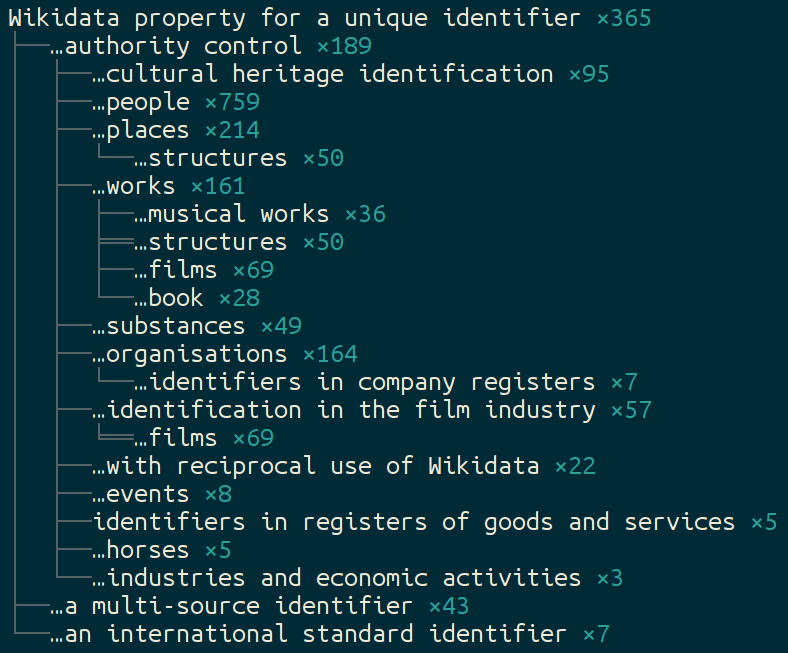
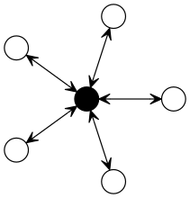

id items
  : ISO 3166-1 alpha-3 code ([Q1341492])\
	ISBN ([Q33057])\
	...\
    \ 

id properties
  : ISO 3166-1 alpha-3 country code ([P298])\
	ISBN-13 ([P212])\
	ISBN publisher prefix ([P3035])\
	...\
    \

id values
  : all values of statements with id properties\
    + some id items, e.g. *ZIP code 10048* ([Q4546087])

# identifier items (1-2/4)

**systems with identifiers**
	
* GeoNames ([Q830106]) $\rightarrow$ GeoNames-ID ([P1566])
* ISO 3166-1:2013 ([Q25275]) $\rightarrow$ [P297], [P298], [P299], [P300]  

**identifiers of these systems**

* ORCID iD ([Q51044]) $\rightarrow$ ORCID iD ([P496])
* Australian Business Number ([Q4823913])\
  $\rightarrow$ Australian Business Number ([P3548])

\color{red} *we don't always have/want both!*

# identifier items (3/4)

**individual identifiers** should be exceptions ($<$ 5,000)

* ZIP code 10048 ([Q4546087])
* .org top-level domain ([Q32131])
* ...

\color{red} *instance-of ([P31]) item types from last slide?*

# identifier items (4/4)

**identifier classes** are subclasses of *unique identifier* ([Q6545185])

* language identifier ([Q2092812])
* publication identifier ([Q36646373])
* ...
* Wikidata property for a unique identifier ([Q19847637])

\color{red} *instance of ([P31]) item types from forelast slide?*

# Identifier properties

\centering

**57%** (2236/3911) of all properties

datatype **external id**entifier or\
Wikidata **prop**erty for a **unique id**entifier ([Q19847637])

----------------- --------------------- -----
			    .  **prop for uniq id**     .
 **external id**                   1952   192
 string                              84
 url								  4
 item								  2
 quantity							  1
 monolingual text					  1
----------------- --------------------- -----

\color{red} *should all be classified under [Q19847637]?*

---

{height=78%}

# Classification of identifier properties (1/2)

**Wikidata property for a unique identifier** ([Q19847637])

Wikidata property...

* ... for items *about* people ([Q18608871])
* ... for *authority control for* people ([Q19595382])

\color{red} *needs some cleanup* \color{black}

# Classification of identifier properties (2/2)

**Classification of corresponding systems**

* identifier classes ([Q6545185])
* classes of Knowledge Organization Systems:\
  catalogs, registries, taxonomies... ([Q6423319])

\color{red} *needs consensus*

\color{red} *related to previous questions*

# Wikidata as linking hub

\centering

{width=40%} \ {width=40%}

* Neubert: *Wikidata as a linking hub for knowledge organization systems*
  17^th^ European NKOS Workshop =[Q41072431]

* Neubert/Voß: 
  [*Wikidata as authority linking hub*](https://www.slideshare.net/jneubert/wikidata-as-authority-linking-hub)
  ELAG 2017

* <http://coli-conc.gbv.de/concordances/wikidata/>

# Summary

## Questions

* how to handle items about identifier systems\
  and/or systems that have identifiers\
  and their corresponding instances?
* classify all external-id properties under [Q19847637]?
* n-to-m mappings & the *Bonny and Clyde Problem*

## Tools

* [wikidata-sdk](https://npmjs.com/package/wikidata-sdk/)
* [wdtaxonomy](https://www.npmjs.com/package/wikidata-taxonomy)
* [wdmapper](https://pypi.python.org/pypi/wdmapper)
* [Mix'n'match](http://tools.wmflabs.org/mix-n-match)

\centering Join [Wikidata:Identifiers]!

[Wikidata:Identifiers]: https://www.wikidata.org/wiki/Wikidata:Identifiers
